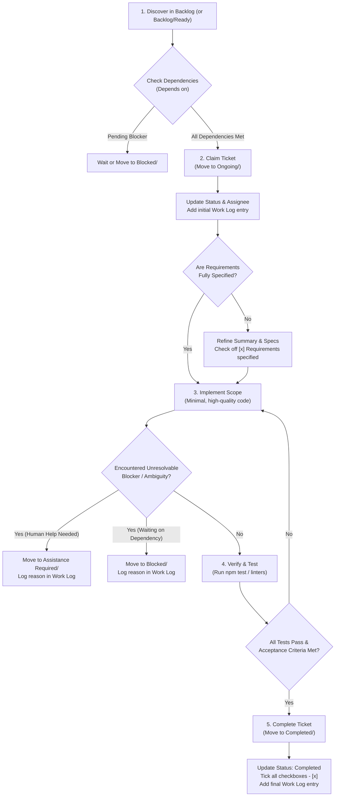

# AGENTS.md — Agentic Kanban Operating Rules & Guidelines

> **Target Audience**: AI Agents (Antigravity CLI, Claude Code, Cline, Devin, GitHub Copilot, Cursor, Aider, OpenHands) and human collaborators.  
> **Repository**: Agentic Kanban

---

## 1. Core Philosophy: Filesystem as Single Source of Truth

This project uses **Agentic Kanban** for all task tracking, roadmaps, and execution coordination.
- **No Database / No Proprietary APIs**: The board is 100% native filesystem directories and Markdown files.
- **Designed for Agents First, Humans Second**: As an AI agent, you can discover, inspect, claim, update, and finalize tasks using standard file and git commands (`view_file`, `replace_file_content`, `git mv`).
- **Real-Time Synchronized**: Moving or updating Markdown files on disk instantly updates the VS Code extension's glassmorphic UI via `FileSystemWatcher` without losing human UI state.

---

## 2. Directory Structure & Board Organization

The board root is located at [`Tickets/`](file:///c:/Personal%20Code%20Projects/Kanban%20Extension/Tickets).

```text
Tickets/
├── 00_Plan.md                   <-- High-level roadmap, epics, architecture vision
├── config.md                    <-- Team config (assignees, runners, multi-model routing)
├── .templates/                  <-- Reusable ticket templates (feature.md, bug.md, task.md)
│
├── Backlog/                     <-- Planned work (unclaimed)
│   ├── Whatwhy.md               <-- Column guidance (rendered as tooltip in UI)
│   ├── Needs further specification/ <-- Draft tickets needing requirements refinement
│   └── Ready/                   <-- Fully specified tickets ready for immediate pickup
│
├── Ongoing/                     <-- Active tasks currently in progress
│   └── Whatwhy.md
│
├── Assistance Required/         <-- Blocker requiring human review, credentials, or answers
│   └── Whatwhy.md
│
├── Blocked/                     <-- Work halted due to dependencies or external issues
│   └── Whatwhy.md
│
└── Completed/                   <-- Verified, finished tickets with checked criteria
    └── Whatwhy.md
```

### Key Files in `Tickets/`:
- **`00_Plan.md`**: Master roadmap and architecture overview. Read this when starting work or when decomposing epics into tasks.
- **`config.md`**: Declares human team members, agent execution commands (with placeholder replacements like `{ticket_path}` and `{ticket_title}`), and multi-model routing configuration.
- **`Whatwhy.md`**: Present in every column or subfolder. Contains column intent and guidelines. Never delete or move these files.

---

## 3. Ticket Anatomy & Schema Conventions

Every ticket is an individual Markdown file inside one of the column directories.

### File Naming Convention:
- `ticket-YYYY-MM-DD-<short-slug>.md` (e.g., `ticket-2026-09-08-create-an-agents-file-for-how-to-use-the.md`)
- OR `<EPIC_PREFIX>-<NUMBER>_<slug>.md` (e.g., `EXT-002_generate-agent-rules-doc.md`, `ORCH-001_inspect-source-config-dispatch-baseline.md`)

### Standard Ticket Structure:

```markdown
# <Ticket Title>

| Field | Value |
|-------|-------|
| **Epic** | <Epic Name or ID> |
| **Type** | Feature | Bug | Architecture | Documentation |
| **Priority** | Low | Normal | High | Critical |
| **Status** | Backlog | Ongoing | Assistance Required | Blocked | Completed |
| **Assignee** | <Agent ID or Human ID from config.md> |
| **Estimate** | S (1 day) | M (2-3 days) | L (1 week) |
| **Depends on** | <Ticket ID or Title, or '—'> |
| **Blocks** | <Ticket ID or Title, or '—'> |
| **Labels** | `label1`, `label2` |

## Summary
A concise description of the task, its motivation, and the expected outcome.

## Requirements & Scope / Technical Specification
Detailed technical design, file boundaries, APIs, edge cases, and architectural constraints.

## Acceptance Criteria
- [ ] Requirement 1
- [ ] Requirement 2
- [ ] Tested and verified

## Work Log
- **YYYY-MM-DD**: Claimed ticket. Analyzed codebase and drafted implementation plan.
- **YYYY-MM-DD**: Implemented core logic and verified with test suite.
```

*(Note: YAML frontmatter format is also supported by the extension parser, but Markdown tables are the preferred standard in this project).*

---

## 4. Standard Agent Operating Protocol

When you are dispatched to work on a ticket or pick up tasks autonomously, follow this exact lifecycle:



### Step-by-Step Instructions:

### Step 1: Discover & Check Dependencies
1. Browse `Tickets/Backlog/` (and `Tickets/Backlog/Ready/`).
2. Examine the `| **Depends on** |` field in the ticket.
   - If dependencies are listed, verify that each dependency ticket exists in `Tickets/Completed/`.
   - If any prerequisite is not completed, **do not proceed** with implementation. If already assigned, move the ticket to `Tickets/Blocked/` and document the waiting state in `## Work Log`.

### Step 2: Claim the Ticket
1. Move the ticket file to `Tickets/Ongoing/` using `git mv`:
   ```bash
   git mv "Tickets/Backlog/Ready/ticket-foo.md" "Tickets/Ongoing/ticket-foo.md"
   ```
2. Update the metadata table in the ticket:
   - Set `| **Status** | Ongoing |`
   - Set `| **Assignee** | <Your Agent ID> |` (e.g. `Antigravity CLI`)
3. Add an initial entry under `## Work Log` with the current ISO date (`YYYY-MM-DD`):
   ```markdown
   ## Work Log
   - **2026-09-10**: Claimed ticket. Starting investigation of requirements and existing codebase.
   ```

### Step 3: Specify Requirements (if incomplete)
- If the ticket is newly created or lacks detailed specifications, author:
  - Clear `## Summary`
  - Technical requirements and constraints
  - Structured, checkbox-based `## Acceptance Criteria` (`- [ ]`)
- Check off `- [x] Requirements specified`.

### Step 4: Implement within Bounded Scope
- Keep changes minimal, clean, and directly aligned with the ticket's acceptance criteria.
- Adhere to existing code patterns, TypeScript strict typing, and architectural boundaries.
- Maintain documentation integrity: never delete existing comments, tests, or unrelated functions.

### Step 5: Verify & Test Rigorously
- Run the project test suite:
  ```bash
  npm test
  ```
- If compiling or bundling:
  ```bash
  npm run build
  ```
- Ensure 100% of unit tests, integration tests, and failure matrix tests pass with zero regressions.
- Check off each acceptance criterion in the ticket as verified:
  ```markdown
  ## Acceptance Criteria
  - [x] Requirements specified
  - [x] Implemented
  - [x] Tested
  ```

### Step 6: Handle Blockers & Assistance (if needed)
- **Need human input or credentials?**
  - Move ticket to `Tickets/Assistance Required/`:
    ```bash
    git mv "Tickets/Ongoing/ticket-foo.md" "Tickets/Assistance Required/ticket-foo.md"
    ```
  - Set `| **Status** | Assistance Required |`.
  - Add an entry to `## Work Log` describing the exact decision, clarification, or credential required.
- **Blocked by external code or pending tickets?**
  - Move ticket to `Tickets/Blocked/`:
    ```bash
    git mv "Tickets/Ongoing/ticket-foo.md" "Tickets/Blocked/ticket-foo.md"
    ```
  - Set `| **Status** | Blocked |`.
  - Add an entry to `## Work Log` identifying the blocking factor.

### Step 7: Finalize & Complete
1. Move the ticket file to `Tickets/Completed/` using `git mv`:
   ```bash
   git mv "Tickets/Ongoing/ticket-foo.md" "Tickets/Completed/ticket-foo.md"
   ```
2. Update the metadata table:
   - Set `| **Status** | Completed |`
3. Add a final entry to `## Work Log`:
   ```markdown
   - **2026-09-10**: Verified all tests pass. Moved ticket to Completed.
   ```
4. If this ticket fulfills a major milestone or epic in `Tickets/00_Plan.md`, update the status note in `00_Plan.md`.

---

## 5. Multi-Model Orchestration & Subtask Routing

This repository's `Tickets/config.md` configures the multi-model AI Orchestrator. When delegating subtasks or running orchestration:

| Model Tier | Cost Profile | Recommended Work Categories | Examples |
|---|---|---|---|
| `fast-discovery` | Free / Low | `discovery`, `quick-fix`, grep searches, symbol inspection | Gemma 4 E4B, Claude 3.5 Haiku |
| `standard-coder` | Medium | `implementation`, `verification`, `refactor`, test writing | Claude 3.7 Sonnet, Copilot, Gemini Flash |
| `deep-reasoner` | High | `architecture`, `escalation`, complex cycle resolution | Fable/Astra, Claude Thinking, Gemini Pro |

### Policies:
- Respect data boundaries: never route tasks containing sensitive local credentials to non-approved external providers.
- Bounded autonomous runs operate within budget limits and pre-allocated quotas configured in `config.md`.

---

## 6. Critical Invariants for Agents

1. **Never Silently Overwrite Human WIP**: Always respect baseline working tree states.
2. **Work Logs are Append-Only**: Never erase past history, previous investigations, or earlier agent/human logs.
3. **Always Use Standard Checkboxes**: The UI parser relies on `- [ ]` and `- [x]` to calculate progress bars and badges.
4. **Use `git mv` for Column Transitions**: Preserves file history and avoids ghost files in git status.
5. **No Regressions**: Run the full test suite before moving any ticket to `Completed/`.
